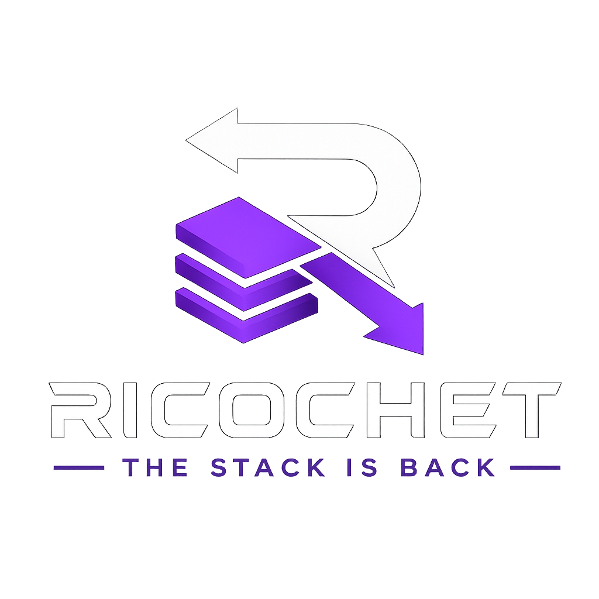

<p align="center">
  
</p>

# Ricochet

Ricochet is a modern, pure-postfix, stack-based programming language descended
in spirit from Forth. The current implementation is a
Rust bytecode VM with dynamic OOP, CLI scripting, MVC web app scaffolding,
template rendering, stack/debug tracing, and early Active Record support for
existing SQLite, PostgreSQL, and MySQL/MariaDB schemas.

Website: [try.ricochet.today](https://try.ricochet.today/)

## Current Features

Ricochet is currently aimed at a developer-facing v1 beta: a usable web app
foundation that other developers can scaffold, run, inspect, and extend.

- Language runtime: Rust bytecode VM, dynamic OOP, stack/debug tracing, regular
  expressions, collections, and postfix control flow.
- Task model: first-class task values with `spawn`, `await`, `await-all`,
  retained completed/failed status, eager background execution, task inspection,
  and task-returning HTTP helpers.
- Desktop GUI beta: trusted local scripts can build escaped `webview` document
  maps, preview them with `rco gui`, and package them as native Windows, Linux,
  or macOS WebView executables with `rco package --gui`. MVC projects can also
  be packaged as local-server desktop WebView apps with
  `rco package --gui --mvc`.
- Terminal UI beta: trusted local scripts can use the `tui` capability for
  alternate-screen terminal apps with drawing, cursor movement, flushing, size
  checks, and key polling/reading through `rco tui` or `rco package --tui`.
- CLI workflow: run `.rco` scripts, format source, build and run bytecode,
  package standalone executables, generate Markdown docs, run Ricochet tests,
  and serve local web apps.
- Package workflow: record and install path/GitHub dependencies, pin Git
  dependencies to immutable commits in `ricochet.lock`, and import local package
  sources by package name.
- MVC web apps: scaffold projects, list routes, serve apps, use hot reload
  during local development, serve static assets from `public/` under `/assets`,
  and render templates with controller-provided view data.
- Controller context: request params, query, form data, headers, cookies,
  lightweight session state, logger, safe manifest config, database capability,
  and optional AI capability are available to controllers.
- Sessions and cookies: sessions are HMAC-signed by default with a per-process
  beta key or a manifest-provided secret, can use authenticated encrypted v2
  cookies, and emit secure cookie attributes for non-local requests.
- Active Record: map models to existing SQLite, PostgreSQL, and MySQL/MariaDB
  tables with `find`, `all`, `where`, `count`, `first`, `exists?`, `insert`,
  `update`, `default-page`, `limit`, `page`, `order-page`, `where-limit`,
  `where-page`, and `where-order-page`.
- Local beta scaffold: `rco new --with-sqlite` creates a zero-service app with
  a seeded SQLite database, `/users` Active Record page, and copyable
  form/session login loop. New apps include `public/app.css` served at
  `/assets/app.css`.
- AI integration: MVC apps can opt into an OpenAI-compatible `[ai.default]`
  provider and receive an `ai` controller capability whose `.chat` method
  returns `Result` maps.
- Security posture: sandboxable host capabilities, no-follow HTTP redirects,
  import/dependency path containment, signed default sessions, view/template
  traversal guards, and TLS-required remote PostgreSQL connections.

Still planned: GUI event/state callbacks, migrations, production auth packages,
and structured AI/schema package helpers.

## Quickstart

For published releases, download the package for your platform from
the [GitHub Releases](https://github.com/BARKx4/Ricochet/releases) page.

On Windows, run `ricochet-vX.Y.Z-windows-x64-setup.exe`. The installer adds
Start Menu entries, including a Ricochet Shell that opens a command prompt with
`rco` available. Portable release ZIPs are also available from the same release
page. Extract the ZIP and run `Ricochet Shell.cmd`, or add the extracted folder
to your `PATH`.

On Linux, install the Debian package with:

```bash
sudo apt install ./ricochet_X.Y.Z_amd64.deb
```

Portable Linux tarballs are also available. Extract the tarball and run
`./install.sh`, or add the extracted folder to your `PATH`.

On macOS, choose the unsigned tarball for your Mac:
`ricochet-vX.Y.Z-macos-arm64.tar.gz` for Apple Silicon or
`ricochet-vX.Y.Z-macos-x64.tar.gz` for Intel. Extract it and run
`./install.sh`, or add the extracted folder to your `PATH`. These beta tarballs
are not notarized by Apple.

For an uninstalled source checkout, install the CLI once:

```powershell
cargo install --path crates/ricochet_cli --bin rco --locked
```

Then use `rco` as the Ricochet toolchain:

```powershell
rco new my_app
rco new --with-sqlite my_beta_app
rco routes my_app
rco doc my_app
rco test my_app
```

MVC apps serve static files from `public/` at `/assets` by default. Override
that with `[web.static] dir = "..."` and `mount = "/..."` in `ricochet.toml`.

Run a script:

```powershell
rco run examples/basic-oop.rco
```

Format and package a script:

```powershell
rco fmt examples/basic-oop.rco
rco build examples/basic-oop.rco
rco run-bytecode build/app.rcob
rco package examples/basic-oop.rco --output basic-oop.exe
```

Preview and package a desktop GUI app:

```powershell
rco gui examples/webview_ui.rco
rco package examples/webview_ui.rco --gui --output webview-ui.exe
```

Run and package an interactive terminal UI app:

```powershell
rco tui examples/tui_counter.rco
rco package examples/tui_counter.rco --tui --output tui-counter.exe
```

Package an MVC app directory as a desktop beta build:

```powershell
rco new my_desktop_app
rco package my_desktop_app --gui --mvc --output my-desktop-app.exe
```

Use `--output webview-ui` on Linux and macOS. Linux GUI launchers use
WebKitGTK 4.1; Debian packages generated for GUI apps declare the
`libwebkit2gtk-4.1-0` and `libgtk-3-0` runtime dependencies.

On Linux, the same `package` command can also create portable tarballs or
Debian packages for a `.rco` file:

```bash
rco package examples/basic-oop.rco \
  --output basic-oop \
  --linux-package tar \
  --linux-package deb \
  --package-name basic-oop \
  --package-version 0.1.0
```

Add a package dependency from a Ricochet project:

```powershell
rco add ./packages/greeter
rco add github:BARKx4/ricochet_auth@v0.1.0 --no-fetch
rco install
```

Local package dependencies can be imported by package name:

```forth
"greeter/greeting" import
packageHello
```

Read an existing binding with `$name`. Declaration words still keep the
name-first shape, and `$` is useful when a declaration name is itself stored in
another variable:

```forth
"users" name var
$name array
"Ada" $users .push! drop
$users .count println
```

Top-level declarations are shared across the VM. Function and method calls get
fresh local declaration scopes, so helper locals declared with `var`, `array`,
`map`, `list`, or `Set` refresh within the active call and do not leak into
later calls.

Spawn a task and await its result:

```forth
[ 40 2 + ] spawn answer var
$answer .status
$answer .running?
tasks .count
$answer await
$answer .status
$answer await
handles array
[ 20 2 + ] spawn $handles .push! drop
[ 30 4 + ] spawn $handles .push! drop
$handles await-all
```

HTTP capability calls can also be launched as tasks:

```forth
"https://example.com" http .get-task request var
$request await value response var
"status" $response .at println
```

Build a webview document for desktop UI hosts:

```forth
"Counter" 1 webview .heading heading var
"Increment" "increment" webview .button button var
$heading "<main>" .concat
$button swap .concat
"</main>" swap .concat body var
"Counter" $body webview .window value document var
```

Serve an MVC app from its project directory:

```powershell
rco serve --host 127.0.0.1 --port 3000
rco serve --watch
```

`--watch` reloads Ricochet MVC routes, controllers, models, views, and the
manifest between requests. If a reload fails, the request returns a clear MVC
error and the next request retries after you fix the source. Combine `--watch`
with `--debug` to print reload trace lines with the new revision and changed
files.

For a zero-service local beta app, `rco new --with-sqlite my_beta_app`
creates `db/development.sqlite3`, seeds `users`, configures Active Record, and
adds `/login`, `/me`, and `/logout` routes that exercise form params and the
session cookie. The manifest shape is:

```toml
[database.default]
adapter = "sqlite"
url = "db/development.sqlite3"
```

For a Postgres-backed app, use the same manifest shape with a Postgres URL:

```toml
[database.default]
adapter = "postgres"
url = "${DATABASE_URL}" # use sslmode=require for remote databases
```

Ricochet requires TLS for remote Postgres connections. `sslmode=disable` is
accepted only for `localhost` or loopback development databases.

For a MySQL or MariaDB-backed app, use the MySQL adapter with a `mysql://` URL:

```toml
[database.default]
adapter = "mysql"
url = "${MYSQL_URL}"
```

Active Record maps model declarations to existing tables; schema migrations are
still planned work.

## Editor Support

A VS Code-compatible TextMate grammar for `.rco` files lives in
`editors/vscode`. It registers the `source.ricochet` scope and highlights
Ricochet comments, strings, `$name` binding reads, dot-method dispatch, bang
words, declarations, control flow, async words, route verbs, core built-ins,
and collection types.

## Developing Ricochet

Use Cargo when changing the Rust implementation itself. For an uninstalled
source-tree run, this is equivalent to `rco run examples/basic-oop.rco`:

```powershell
cargo run -p ricochet_cli --bin rco -- run examples/basic-oop.rco
```

## Verification

For contributor verification, use a current stable Rust toolchain and install
the formatter, linter, and audit plugin explicitly:

```powershell
rustup component add rustfmt clippy
cargo install cargo-audit --locked
```

Then run:

```powershell
cargo fmt --all -- --check
cargo clippy --workspace --all-targets -- -D warnings
cargo test --workspace
cargo audit
powershell.exe -NoProfile -ExecutionPolicy Bypass -File .\scripts\acceptance.ps1
```

The acceptance suite validates the static reference docs, examples, scaffolded
project checks/tests, and a live `rco serve` smoke request against the generated
no-database scaffold.

## Release Packaging

Windows release packages are built from this repository with:

```powershell
powershell.exe -NoProfile -ExecutionPolicy Bypass -File .\scripts\package-release.ps1
```

The script builds `rco.exe`, `rco-gui.exe`, and `ricochet.exe`, creates a
portable ZIP, writes `SHA256SUMS.txt`, and creates a Windows `.exe` installer when NSIS
`makensis.exe` is installed. GitHub Actions installs NSIS automatically in the
release workflow.

Linux release packages are built on Linux with:

```bash
bash scripts/package-release-linux.sh
```

The script builds `rco`, `rco-gui`, and `ricochet`, creates a portable tarball
with an `install.sh` helper, writes `SHA256SUMS-linux-x64.txt`, and creates a
Debian `.deb` package with `dpkg-deb`.

Unsigned macOS release tarballs are built on macOS with:

```bash
bash scripts/package-release-macos.sh --target macos-arm64
bash scripts/package-release-macos.sh --target macos-x64
```

The script builds `rco`, `rco-gui`, and `ricochet`, creates a portable tarball
with an `install.sh` helper, and writes a target-specific checksum file. GitHub
Actions builds Apple Silicon and Intel tarballs on separate macOS runners.

To publish a GitHub release, push a version tag:

```powershell
git tag vX.Y.Z
git push origin vX.Y.Z
```

The release workflow packages the Windows, Linux, and macOS artifacts, writes a
combined `SHA256SUMS.txt`, and attaches the ZIP, Windows installer, Linux
tarball, Debian package, unsigned macOS tarballs, and checksums to the GitHub
release.

The same workflow also runs nightly from `main`. Nightly builds use a version
like `X.Y.Z-nightly.N`, build the same Windows, Linux, and macOS packages, and
upload them as GitHub Actions artifacts for 30 days. Nightlies do not create
public GitHub releases.

## Reference Docs

The documentation website is static and lives at
`docs/reference/index.html`. Open it directly in a browser; there is no build
step.

## Safety Notes

The CLI uses the `trusted` capability profile by default for local scripts.
Pass `--capability-profile sandboxed` with `rco run`, `rco run-bytecode`,
`rco repl`, or `rco test` to start with filesystem, HTTP, TUI, and webview
disabled.
In the sandboxed profile, `--fs-root <path>` enables filesystem access only
under that directory, `--fs-readonly` denies writes,
`--http-allow-host <host>` enables HTTP only for named hosts, and
`--allow-tui` enables terminal UI access, while `--allow-webview` enables
webview document building. `--no-fs`, `--no-http`, `--no-tui`, and
`--no-webview` still deny those host powers explicitly in either profile.
`--no-env` denies environment/current-directory reads, and `--no-sleep` denies
script sleeps. Embedded hosts can leave capabilities disabled. HTTP calls do not
follow redirects, use a timeout and response body cap, and filesystem access
remains powerful CLI behavior unless you deny or bound it with these flags.

For v1 beta testing, keep `trusted` for your own local scripts and generated
apps. Use `sandboxed` for untrusted examples, bug reports, package reviews, or
third-party code, opening only the filesystem root or HTTP hosts the test
actually needs.
