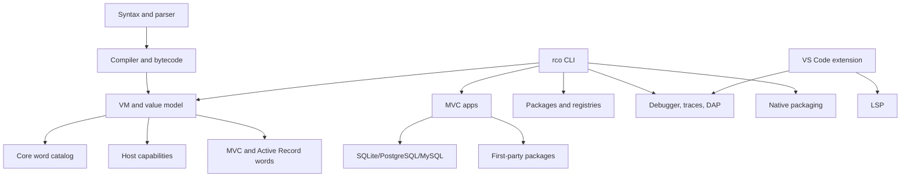

# Ricochet Feature Map

This is the agent-facing map of what Ricochet currently does, where to verify
it, and what is still partial. Use it before making roadmap claims or adding a
new feature. If this file conflicts with code, tests, or `docs/reference`, trust
the live code and update this map.

Status labels:

- `implemented`: shipped in code, docs, and tests or examples.
- `beta`: usable, but intentionally scoped for the v1 developer beta.
- `polish`: the foundation exists; remaining work is ergonomics, completeness,
  or production hardening.
- `future`: not currently implemented as a Ricochet surface.

## Orientation



## Start Here

- Public language syntax must stay postfix/RPN. The repo-root `AGENTS.md`
  syntax guardrail is binding for new feature work.
- The static reference site is `docs/reference/index.html`; its word catalog is
  `docs/reference/app.js`.
- Run `rco words --check` from a source checkout when changing public words.
- Follow `docs/adding-words.md` when adding, renaming, or removing public words.
- Do not infer missing features from older design text without checking this
  file, `README.md`, `docs/reference/index.html`, and focused tests.

## Command Families

| Family | Status | Surfaces | Evidence |
| --- | --- | --- | --- |
| Project and MVC | implemented beta | `rco new`, `routes`, `serve`, `migrate`, `doctor` | `crates/ricochet_cli/src/lib.rs`, `crates/ricochet_web`, `README.md`, `docs/reference/index.html` |
| Runtime | implemented beta | `repl`, `run`, `debug`, `run-bytecode`, `build`, `test`, `image`, `emit-source` | `crates/ricochet_cli/src/lib.rs`, `crates/ricochet_vm/src/vm.rs`, `crates/ricochet_cli/tests/cli_smoke.rs` |
| Packaging | implemented beta | `package`, `gui`, `tui`, `--gui --mvc`, `--linux-package tar|deb` | `crates/ricochet_cli/src/lib.rs`, `scripts/package-release*.sh`, `scripts/package-release.ps1` |
| Dependencies | implemented beta | `add`, `install`, `verify`, `audit` | `crates/ricochet_cli/src/lib.rs`, `crates/ricochet_cli/tests/cli_smoke.rs` |
| Registries | implemented beta | `publish`, `registry rebuild`, `registry check`, `search` | `crates/ricochet_cli/src/lib.rs`, `README.md`, `docs/reference/index.html` |
| Editor and diagnostics | implemented beta | `lsp`, `lsp-diagnostics`, `lint`, `fmt`, `words` | `crates/ricochet_cli/src/lsp.rs`, `editors/vscode`, `scripts/validate-editor-assets.ps1` |
| Docs and quality | implemented beta | `doc`, `bench`, docs validation, acceptance suite | `docs/reference/validate.ps1`, `scripts/acceptance.ps1`, `.github/workflows` |

## Word Catalog Groups

The live source of truth is `rco words --json` and `docs/reference/app.js`.
Current top-level groups are:

- `stack`: `swap`, `dup`, `drop`, `over`, `rot`, `nip`, `tuck`, `pick`,
  `roll`, `depth`, `clear`.
- `math`: checked integer and finite float math, comparison, numeric conversion
  words, boolean words, assertion helpers, and readable aliases such as `add`,
  `subtract`, `multiply`, `divide`.
- `data`: `nil`, booleans, `array`, `map`, `var`, dynamic `get`, `set`,
  `empty?`, `nil?`.
- `collection`: list/set construction, range, collection mutators, indexing,
  counting, filtering, mapping, reducing, searching, and joining.
- `string`: trim/slice/search/case/concat, JSON encode/decode, and regex
  helpers.
- `oop`: `Subclass`, `Field`, `Accessor`, `Table`, `Method`, `new`, `self`,
  `send`, generated `field.get` / `field.set`.
- `control`: `function`, `return`, blocks, `if`/`else`/`end`, `while`,
  `break`, `continue`, `spawn`, `await`, `await_all`, `release_task`.
- `result`: `ok?`, `value`, `error`, `ok`, `fail`, `error?`, `unwrap_or`,
  `map_result`, `and_then`, `result_envelope`, result assertions.
- `inspect`: type/class/method inspection, task metadata and predicates,
  `inspect`, `debug`.
- `web`: route verbs, controller response words, and Active Record words.
- `system`: host effects, capabilities, date/time, environment/config/secrets,
  process/PTY, HTTP, TCP/WebSocket sockets, TUI, webview, approvals.

## Language Core

Status: implemented beta.

Implemented:

- Pure postfix/RPN execution model with no infix parser or operator precedence.
- `$name` for ordinary static variable reads; dynamic by-name reads use
  `"name" get` or `fieldName get`.
- Declaration words include `Subclass`, `Field`, `Accessor`, `Table`, `Method`,
  `function`, `var`, `array`, `list`, and `map`.
- Blocks use `[ ... ]`; optional args metadata uses `( in -> out )`.
- Control flow includes `if`/`else`/`end`, `while`, `break`, `continue`,
  `return`, first-class blocks, and `call`.
- Compile-time expression macros use string-named `"name" Macro` declarations,
  explicit `"name" macro_call` invocation, AST quoting/splicing through
  `quote_ast` and `ast_splice`, whole-item row generation through
  `quote_items`, local/static-import/package lookup, and `rco expand`
  inspection with a stable v1 JSON schema, source inventory, source maps,
  cache metadata, and canonical package macro IDs.
- `quote_items` supports ordinary expression-item rows, class-body rows such as
  `Accessor`, `Field`, `Table`, and `Method`, and top-level declaration rows
  encoded as `[ body ] "name" function`,
  `( args -> outputs ) [ body ] "name" function`, or
  `[ body-items ] Name Superclass Subclass`.
- Lexer/parser/compiler support comments, doc comments, strings with validated
  escapes, signed integer literals, finite float literals with decimals or
  exponents, `$` references, dot selectors, and diagnostics for legacy
  leading-dot syntax.
- Dash-prefixed public words are rejected; `-` is reserved for subtraction and
  negative literals.

Evidence:

- `AGENTS.md`
- `docs/superpowers/specs/2026-06-09-ricochet-design.md`
- `crates/ricochet_syntax/src/lexer.rs`
- `crates/ricochet_syntax/src/parser.rs`
- `crates/ricochet_compiler/src/compiler.rs`
- `crates/ricochet_cli/tests/cli_smoke.rs`
- `examples/macro_release_scorecard.rco`
- `examples/showcase/package_macro_queue_report`

Do not assume:

- Do not introduce leading-dot source syntax, namespace-dot host APIs, or
  receiver-first pseudo-object host calls such as `http .request`.
- Do not use `name get` in new docs/examples for ordinary variable reads.
- Do not expect `rco fmt` to migrate unsupported syntax; diagnostics and LSP
  quick fixes point users at replacements.

## VM And Runtime Values

Status: implemented beta.

Implemented:

- Rust bytecode VM with chunks, nested block chunks, source spans, frames, and
  debug events.
- Runtime values include nil, bool, signed i64 `Number`, finite f64 `Float`,
  string, array, list, map, set, class, instance, member selector, block, task,
  result, regex, and capability.
- Versioned VM images preserve safe language state for stacks, globals,
  functions, classes, instances, blocks, and results. `rco repl --image PATH`
  resumes interactive bindings/classes/functions; `:save`, `:load`, and
  `:bindings` inspect or move image state during a REPL session.
- Plain integer literals stay `Number`; decimal or exponent literals produce
  `Float`; mixed numeric arithmetic promotes to `Float`.
- Numeric conversion words such as `to_integer`, `to_tinyint`,
  `to_unsigned_int`, `to_float32`, and `to_float64` return `Result` values for
  parse, range, and precision-boundary failures.
- Dynamic OOP supports classes, inheritance, fields/accessors, methods,
  generated accessor selectors, `self`, and dynamic `send`.
- Mutable collections are shared values; mutators return the same collection.
- Results are explicit stack values and are not truthy in conditions.

Evidence:

- `crates/ricochet_bytecode/src/op.rs`
- `crates/ricochet_bytecode/src/chunk.rs`
- `crates/ricochet_vm/src/value.rs`
- `crates/ricochet_vm/src/image.rs`
- `crates/ricochet_vm/src/vm.rs`
- `crates/ricochet_vm/src/builtins.rs`
- `crates/ricochet_cli/src/lib.rs`
- `crates/ricochet_cli/tests/cli_smoke.rs`

Remaining:

- Richer suspended-task debugger views are still polish.
- Source emission is a readable source-like bytecode view; do not treat it as a
  stable byte-for-byte source reconstruction contract.

Do not assume:

- Awaited task handles disappear. Completed and failed handles are retained and
  can be inspected or reawaited until `release_task`.
- Result values can be used directly as conditions. Use `ok?`, then `value` or
  `error`.

## Async And Tasks

Status: implemented beta.

Implemented:

- `[ ... ] spawn` creates first-class task values and captures the spawn-time VM
  environment.
- `await` and `await_all` resolve tasks; completed handles reuse cached values.
- Failed handles retain failed status and rethrow when awaited.
- `tasks`, `id`, `info`, `task_status`, `pending?`, `running?`, `completed?`,
  and `failed?` expose task metadata.
- `release_task` cleans up completed or failed retained task handles.
- HTTP request task helpers exist for GET, POST JSON, and mapped requests.

Evidence:

- `crates/ricochet_vm/src/vm.rs`
- `crates/ricochet_vm/src/builtins.rs`
- `docs/reference/app.js`
- `crates/ricochet_cli/tests/cli_smoke.rs`

Remaining:

- Deeper suspended-task stack inspection in debugger views is future polish.

## Results, Date, And Time

Status: implemented beta.

Implemented:

- Result words: `ok?`, `value`, `error`, `ok`, `fail`, `error?`, `unwrap_or`,
  `map_result`, `and_then`, `result_envelope`, `assert_ok`, `assert_error`.
- `result_envelope` produces `{ ok, data, error, meta }` maps for app/API
  boundaries.
- Date/time words use UTC Unix epoch milliseconds as the timestamp boundary.
- Timestamp words parse/format RFC3339, expose parts maps, build timestamps from
  parts, and perform timestamp arithmetic.
- Date words parse/format calendar dates, convert to/from timestamps, and do day
  arithmetic.
- Duration unit words produce millisecond durations; `duration_parts` breaks
  durations down.
- Date/time user-data failures return Ricochet `Result` errors.

Evidence:

- `crates/ricochet_vm/src/builtins.rs`
- `crates/ricochet_vm/src/vm.rs`
- `docs/reference/app.js`
- `README.md`
- `crates/ricochet_cli/tests/cli_smoke.rs`

Remaining:

- Exact decimal, money/smallmoney, arbitrary precision integers, and full u64
  unsigned-bigint storage are future work.

## Host Capabilities

Status: implemented beta.

Implemented:

- Capability profiles: `trusted` and `sandboxed`.
- CLI flags narrow filesystem, HTTP, TCP/WebSocket sockets,
  environment, sleep, TUI, webview, process, and PTY capabilities.
- `runtime_capabilities` reports the active powers available to the VM.
- Filesystem words: `fs_read_text`, `fs_write_text`, `fs_exists?`, `fs_list`,
  `fs_create_dir`, `fs_delete`.
- Workspace words: `workspace_resolve`, `workspace_contains?`,
  `workspace_metadata`, `workspace_list`, `workspace_read_text`,
  `workspace_write_text`, `workspace_mkdir`, `workspace_delete`,
  `workspace_copy`, `workspace_move`.
- HTTP words cover simple calls, structured request maps, bearer/JSON/timeout
  helpers, task-returning requests, and retained streams with read/cancel/release.
- Socket words cover retained raw TCP and WebSocket clients/listeners with
  listen/accept/connect/read/write-or-send/close/release, explicit
  `--allow-sockets`, and optional `--socket-allow-host` bind/destination
  allowlists.
- MVC upload stream words cover retained temporary upload files with
  `upload_streams`, `upload_stream`, `upload_read`, and `upload_release`.
- Process words cover blocking spawn, task spawn, retained process jobs, reads,
  cancellation, release, and env option maps.
- PTY words cover retained terminal sessions, write/read/resize/stop/release,
  list, and detail.
- TUI words cover alternate screen, cursor movement, writes, flush, size, and key
  polling/reading.
- Webview words build escaped GUI document fragments and state/action documents
  for `rco gui` and `rco package --gui`.
- Approval words provide runtime-local records with exactly-once token claiming.
- Environment/config/secret words cover env get/set, secret references,
  secret resolution, and nested config lookup.

Evidence:

- `crates/ricochet_vm/src/builtins.rs`
- `crates/ricochet_vm/src/process_runtime.rs`
- `crates/ricochet_vm/src/pty_runtime.rs`
- `crates/ricochet_vm/src/http_stream_runtime.rs`
- `crates/ricochet_vm/src/upload_runtime.rs`
- `crates/ricochet_vm/src/socket_runtime.rs`
- `crates/ricochet_vm/src/approval_runtime.rs`
- `crates/ricochet_cli/src/lib.rs`
- `crates/ricochet_cli/tests/cli_smoke.rs`
- `crates/ricochet_web/tests/web_mvc.rs`
- `docs/reference/app.js`

Remaining:

- HTTP redirects remain disabled; `follow_redirects=true` is explicitly not
  supported.
- Approval words are primitives, not a full authorization policy.
- Browser automation and screenshot capture are not Ricochet core features.

Safety:

- `fs_delete` and `workspace_delete` are destructive. The project data-safety
  policy still requires asking the user before deleting anything.
- Do not assume `rco serve` uses the same broad trusted defaults as local CLI
  scripts. MVC capabilities are narrower and flag/manifest-driven.
- `docs/reference/app.js` alias metadata is not proof of VM dispatch. Verify
  aliases against `crates/ricochet_vm/src/vm.rs` before relying on them.

## Web, MVC, Templates, And Static Assets

Status: implemented beta.

Implemented:

- `rco new` scaffolds an MVC app; `rco new --with-sqlite` creates a zero-service
  SQLite beta app with seeded data, migrations, `/users`, `/login`, `/me`, and
  `/logout`.
- `rco routes` lists routes.
- `rco serve` runs the current directory as an MVC app.
- `rco serve --watch` reloads routes, controllers, models, views, and manifest
  configuration between requests while active requests keep their snapshot.
- Routes use `METHOD "path" Controller "action" route`.
- Controller responses use `view`, `text`, `json`, `redirect`, `status`, and
  `header`.
- Request context includes method, path, params, query, form, body/json, uploads,
  files, headers, cookies, session, config, logs, and capabilities such as `db`
  and optional `ai`.
- Declared action args bind route params first, then form fields, JSON fields,
  upload fields, query params, and context values.
- Templates run Ricochet scalar interpolation with HTML escaping by default.
  Embedded template directives support non-rendering script blocks
  (``), postfix conditionals (`` /
  `` / ``), and collection loops
  (`` / ``).
- Static assets serve from `[web.static]`, defaulting to `public` mounted at
  `/assets`, with traversal/canonicalization guards.

Evidence:

- `crates/ricochet_web/src/server.rs`
- `crates/ricochet_web/src/router.rs`
- `crates/ricochet_web/src/controller.rs`
- `crates/ricochet_web/src/template.rs`
- `crates/ricochet_web/tests/web_mvc.rs`
- `examples/showcase/sqlite_notes`
- `README.md`
- `docs/reference/index.html`

Remaining:

- MVC multipart uploads preserve small-file `text`/`data_base64` compatibility
  and expose large files through bounded temporary upload streams with explicit
  read/release words.
- Upload limits are configured through `[web.uploads] max_request_bytes`,
  `max_file_bytes`, `memory_threshold_bytes`, and `max_retained_streams`.

Do not assume:

- Static assets are missing.
- Sessions are unsigned JSON cookies.
- Scaffold auth is production auth.

## Data, Active Record, And Migrations

Status: implemented beta.

Implemented:

- `[database.default]` supports SQLite, PostgreSQL, MySQL, and MariaDB.
- Active Record maps models to existing tables through `Table` and `Accessor`.
- Read/query words include `all`, `find_record`, `default_page`, `where`,
  `limit`, `page`, `order_page`, `where_limit`, `where_page`,
  `where_order_page`, `count_records`, `first_record`, and `exists?`.
- Write words include `insert` and `update`.
- `default_page` provides a bounded list page and orders by `id asc` when the
  model maps an `id`.
- `rco migrate new NAME [--dsl]` creates timestamped raw SQL migrations or
  paired Ricochet migration DSL `.up.rco` / `.down.rco` files.
- `rco migrate status` and `rco migrate apply` read ordered SQL and Ricochet
  migration DSL files from `db/migrations` and record applied versions in
  `schema_migrations`.
- `rco migrate rollback` supports reversible SQLite, PostgreSQL, and
  MySQL/MariaDB migrations through paired `VERSION_name.up.sql` /
  `VERSION_name.down.sql` files or
  `VERSION_name.up.rco` / `VERSION_name.down.rco` files, while existing
  one-file `VERSION_name.sql` migrations remain apply-compatible.
- The native migration DSL is scoped to migration files and supports postfix
  table creation/drop, column creation/add/drop/rename, index create/drop,
  unique index creation, and column modifiers `primary_key`, `not_null`,
  `unique`, and `default`, compiling to SQLite, PostgreSQL, or MySQL/MariaDB
  SQL.
- `rco migrate dump` writes deterministic beta DDL schema snapshots for
  SQLite, PostgreSQL, and MySQL/MariaDB, excluding `schema_migrations` and
  adapter-internal objects where applicable.
- `rco seed` runs ordered SQLite, PostgreSQL, and MySQL/MariaDB
  `db/seeds/*.sql` and `db/seeds/*.rco` files, with an explicit
  non-idempotent seed warning.
- The SQLite scaffold creates an initial migration and seeds a local database.

Evidence:

- `crates/ricochet_web/src/active_record.rs`
- `crates/ricochet_web/src/database_capability.rs`
- `crates/ricochet_web/src/manifest.rs`
- `crates/ricochet_cli/src/lib.rs`
- `crates/ricochet_cli/tests/cli_smoke.rs`
- `crates/ricochet_web/tests/web_mvc.rs`
- `docs/reference/app.js`

Remaining:

- None for the v1 beta database lifecycle.

Do not assume:

- Active Record is a full schema-definition ORM; it targets existing schemas.
- Migrations are missing. SQL `status` and `apply` exist.
- PostgreSQL/MySQL rollback, schema dump, and seed commands are missing.
- `rco migrate dump` is a replacement for `pg_dump` or `mysqldump`; it is a
  deterministic Ricochet beta DDL snapshot.

## Sessions, Auth, Forms, And AI

Status: implemented beta.

Implemented:

- MVC sessions use the `ricochet_session` cookie.
- Sessions are HMAC-signed by default with a per-process beta key or a
  manifest-provided secret.
- Authenticated encrypted v2 cookies are available through manifest-provided
  env-backed secrets.
- Secure cookie attributes are emitted for non-local requests.
- SQLite scaffold includes a copyable local beta form/session login loop.
- `@ricochet/auth` provides session guard predicates, route guard result maps,
  fail-closed CSRF helpers, session construction, cookie option helpers,
  credential normalization, password policy validation, and Argon2id password
  hash/verify wrappers.
- `@ricochet/forms` provides field maps, validation maps, schema validation, and
  multipart file maps.
- MVC `[ai.default]` injects an `ai` controller capability whose `chat` method
  calls an OpenAI-compatible `/chat/completions` endpoint and returns `Result`
  maps.
- `@ricochet/ai` provides OpenAI-compatible request builders, secret reference
  helpers, SSE parsing, and stream text extraction.
- `@ricochet/test_helpers` provides assertion, fixture, HTTP response, and
  temporary workspace helpers.

Evidence:

- `crates/ricochet_vm/src/builtins.rs`
- `crates/ricochet_cli/tests/cli_smoke.rs`
- `crates/ricochet_web/src/server.rs`
- `crates/ricochet_web/src/manifest.rs`
- `crates/ricochet_web/src/ai_capability.rs`
- `packages/README.md`
- `packages/ricochet_auth`
- `packages/ricochet_forms`
- `packages/ricochet_ai`
- `packages/ricochet_test_helpers`
- `examples/showcase/package_auth_forms`
- `examples/showcase/ai_provider_probe`

Remaining:

- Richer provider packages, retries/tool execution, AI streaming integration,
  and structured schema validation remain future package work.

Do not assume:

- The scaffold login loop is full production auth.
- MVC AI or first-party AI helpers are missing.

## Packages And Registries

Status: implemented beta.

Implemented:

- `rco add` records path, GitHub, local registry, and static registry
  dependencies.
- `rco install` installs manifest dependencies and writes `ricochet.lock`.
- `rco verify` checks dependency manifest/lock consistency and package-content
  integrity without rewriting.
- `rco audit` reports dependency status and supports JSON output.
- Static registry workflows include publish, rebuild, check, search, provenance
  and signature metadata, `sha256:` archive verification, semver requirements,
  aliases, scoped package names, and lock hardening against same-version
  replacement.
- Static imports shaped like `package/module` resolve through
  `[dependencies.package]` when no relative file exists.
- Dynamic runtime imports are available through `import_dynamic`,
  `module_call`, and `module_get`. Host loaders reuse the compiler resolver,
  enforce path containment, and verify package lock integrity before loading.
- Release packages include the first-party package catalog.

Evidence:

- `crates/ricochet_cli/src/lib.rs`
- `crates/ricochet_cli/tests/cli_smoke.rs`
- `README.md`
- `docs/reference/index.html`
- `packages/README.md`
- `scripts/package-release.ps1`
- `scripts/package-release-linux.sh`
- `scripts/package-release-macos.sh`

Remaining:

- A central hosted package registry is future work; current registry support is
  local file-backed registries plus static file/HTTP indexes.

Do not assume:

- Package support is design-only.
- Release archives omit packages.

## Debugger, LSP, And Editor Tooling

Status: implemented beta.

Implemented:

- Terminal debugger supports `step`, `next`, `out`, `continue`, `abort`,
  `stack`, `locals`, `globals`, `self`, and `tasks`.
- `rco run --trace-file` writes JSON runtime traces.
- `rco debug --json` streams JSON Lines events.
- `rco debug-adapter` speaks Debug Adapter Protocol over stdio.
- DAP supports launch, source breakpoints, continue, pause, step into/over/out,
  stack frames, scopes, variables, output events, and termination.
- VS Code extension includes TextMate grammar, LSP client, stack trace
  visualizer, debug configuration, and live debugger stack panel.
- `rco lsp` provides diagnostics, completion, hover, go-to-definition, document
  symbols, semantic tokens, formatting, quick fixes, prepare-rename, and
  single-document rename.
- LSP diagnostics and quick fixes cover `$name` migration and leading-dot legacy
  syntax.
- `rco words --check` validates docs/reference and TextMate grammar against the
  embedded LSP inventory.

Evidence:

- `docs/debugger-integrations.md`
- `crates/ricochet_cli/src/lib.rs`
- `crates/ricochet_cli/src/lsp.rs`
- `crates/ricochet_cli/tests/cli_smoke.rs`
- `editors/vscode/package.json`
- `editors/vscode/extension.js`
- `editors/vscode/syntaxes/ricochet.tmLanguage.json`
- `scripts/validate-editor-assets.ps1`

Remaining:

- Request-fault pause before MVC HTTP 500 is debugger polish.
- Dedicated TUI/browser debugger UIs beyond terminal, DAP, and VS Code are
  future polish.
- Source breakpoints are line-based until stable instruction IDs exist.

Do not assume:

- Debugger UI is broadly missing.
- DAP or VS Code debugger surfaces are missing.

## Build, Packaging, Release, And CI

Status: implemented beta.

Implemented:

- `rco build` writes bytecode to `build/app.rcob`.
- `rco run-bytecode` executes `.rcob`.
- `rco package` creates standalone launcher executables by embedding bytecode
  or MVC bundles.
- `rco package --tui`, `--gui`, and `--gui --mvc` cover console, WebView, and
  local-server desktop apps.
- Linux `rco package` can also emit tarballs and Debian packages.
- Release scripts build Windows ZIP/NSIS installer, Linux tar/deb, and unsigned
  macOS tarballs.
- Release workflow uploads Windows, Linux, macOS, checksum, and installer
  artifacts and runs nightly builds.
- CI validates formatting, clippy, tests, audit policy, benchmarks, reference
  docs, editor assets, and acceptance.

Evidence:

- `crates/ricochet_cli/src/lib.rs`
- `scripts/package-release.ps1`
- `scripts/package-release-linux.sh`
- `scripts/package-release-macos.sh`
- `.github/workflows/ci.yml`
- `.github/workflows/release.yml`
- `README.md`
- `docs/releases`

Remaining:

- Production-grade app distribution polish remains: signing, notarization,
  platform metadata, app store packaging, and updater workflows.

Do not assume:

- Native packaging is missing.

## Current Limits And Roadmap

Implemented foundations that should not be listed as missing:

- SQL and native DSL migrations (`rco migrate new/status/apply/rollback/dump`)
  plus ordered SQL/Ricochet seed files.
- Native app packaging (`rco package`, release scripts, `.deb`, installers).
- Debugger, DAP, and VS Code debug surfaces.
- Static assets.
- Signed and optionally encrypted sessions.
- MVC AI capability and first-party AI helpers.
- Package add/install/verify/audit/publish/static registry/search workflows.
- Retained process, PTY, HTTP stream cleanup/release.
- Date/time/duration words.
- Beta compile-time expression macros, including local/static-import/package
  path lookup and `rco expand` inspection.
- Persistent REPL images, image inspection, and source-like bytecode emission.
- Dynamic runtime imports with module metadata and lock/path enforcement.

Still real remaining work:

- Central hosted package registry.
- Richer suspended-task debugger views and request-fault pause before MVC HTTP
  500.
- Dedicated TUI/browser debugger UI beyond terminal, DAP, and VS Code.
- Richer AI provider packages, streaming integration, and structured schema
  validation.
- Production app distribution polish: signing, notarization, metadata, store or
  updater workflows.

## Maintenance Rules

Update this map when a feature family changes status, gains a new public command
or word family, or when a stale assumption is discovered.

For public word changes, also follow `docs/adding-words.md`.

Recommended verification after feature-map-only edits:

```powershell
powershell.exe -NoProfile -ExecutionPolicy Bypass -File .\docs\reference\validate.ps1
powershell.exe -NoProfile -ExecutionPolicy Bypass -File .\scripts\validate-editor-assets.ps1
rtk cargo run -p ricochet_cli --bin rco -- words --check --docs-app docs/reference/app.js --grammar editors/vscode/syntaxes/ricochet.tmLanguage.json
rtk git diff --check
```

For release-facing feature changes, also run:

```powershell
rtk cargo fmt --all -- --check
rtk cargo clippy --workspace --all-targets -- -D warnings
rtk cargo test --workspace
powershell.exe -NoProfile -ExecutionPolicy Bypass -File .\scripts\acceptance.ps1
```
